<div align="center">

# 🛡️ Sentinel: Hybrid Quantitative Trading Infrastructure
### Regime-Adaptive Institutional Execution Engine


<p align="center">
  <em>An institutional-grade algorithmic ecosystem engineered to solve the "Trilogy of Failure": Look-Ahead Bias, Overfitting, and Regime Shifts.</em>
</p>

</div>

---

## 📖 Executive Summary

**Sentinel** is a comprehensive Quantitative Research & Execution Pipeline designed to bridge the gap between backtest theory and live market execution. Unlike standard retail bots that rely on lagging indicators, Sentinel employs a **Hybrid AI Architecture** that dynamically classifies market regimes and deploys specialized "Agent" models.

Crucially, it integrates a **Forensic Data Pipeline** that enforces strict causal integrity ($T-1$), ensuring that every backtest signal is theoretically executable in a live environment via the MetaTrader 5 bridge.

---

## 🧠 Core Architecture: The "Hybrid Brain"

The decision engine rejects the monolithic model approach. Instead, it uses a **"Committee of Experts"** topology:

```mermaid
graph TD
    subgraph Ingestion
        A[Live Market Data] -->|Fetch & Clean| B(Feature Engineering)
    end

    subgraph The Hybrid Brain
        B --> C{Regime Filter}
        C -->|Low Volatility| D[Scalper Agent]
        C -->|High Volatility| E[Breaker Agent]
        
        D & E --> F[XGBoost Directional Alpha]
        B --> G[Autoencoder Anomaly Detector]
    end

    subgraph Execution
        F --> H{Consensus Logic}
        G -->|High Reconstruction Error| I[❌ HARD LOCK: Black Swan]
        H -->|Prediction > Threshold| J[✅ Dynamic Sizing & Execution]
    end
```



### 1. Brute-Force Mining (`rule2.py`)

* **Iterations:** 5,000+ cycles.
* **Feature Bagging:** Random subset of 15–35 features per cycle.
* **Logic Extraction:** Parses the Decision Tree structure into human‑readable SQL‑like rules.

### 2. The "Honest" Validator

The immune system of the engine. Every rule is tested on untouched validation data.

**Validation Logic:**

* JIT‑compiled backtester using **Numba**.
* **ATR‑based Stop Loss** and **1.5R Take Profit**.
* Time‑window outcome evaluation.
* A rule is saved only if:

  * It generates **>100 trades**, and
  * Achieves **>75% win rate**.

---

## 🚀 Performance Optimization

| Component     | Tech            | Impact                                   |
| ------------- | --------------- | ---------------------------------------- |
| Backtester    | Numba (`@njit`) | Validates 100,000+ signals in seconds    |
| Tree Training | Scikit‑Learn    | Uses class balancing for rare events     |
| Data I/O      | Pandas          | Handles large H4/M5 datasets efficiently |

---

## 📂 Project Structure

```bash
python-trading-rule-discovery/
├── rule2.py                # Main Discovery Engine (Brute Force + Validation)
├── rule3.py                # HTF Variant
├── features_GBP.csv        # Input Dataset (GitIgnored)
├── buyking.json            # Validated Buy Rules
├── sellking.json           # Validated Sell Rules
└── README.md               # Documentation
```

---

## 💻 Usage

### 1. Prepare Data

Ensure you have a cleaned CSV file (`features_GBP.csv`) containing your full feature set.

### 2. Run Discovery

```bash
python rule2.py
```

The script will show a TQDM progress bar as it mines and validates rules.

### 3. Inspect Output

Example from `buyking.json`:

```json
{
    "rule_id": "HONEST_GBPUSD_BUY_001",
    "conditions": [
        {"feature": "rsi_14", "operator": "<=", "value": 30.5},
        {"feature": "adx_14", "operator": ">", "value": 25.0}
    ],
    "validation_winrate": 0.78,
    "validation_trades": 142
}
```

---

## ⚠️ Disclaimer

<div align="center"><strong>Research Code</strong></div>

This engine is intended for quantitative research and educational use.

* Overfitting remains a risk—"Honest Validation" reduces but does not eliminate it.
* Market regimes change; a rule found in one may fail in another.
* Real trading includes spread & slippage not fully modeled here.

---

Engineered by **Redouane Boundra**.
